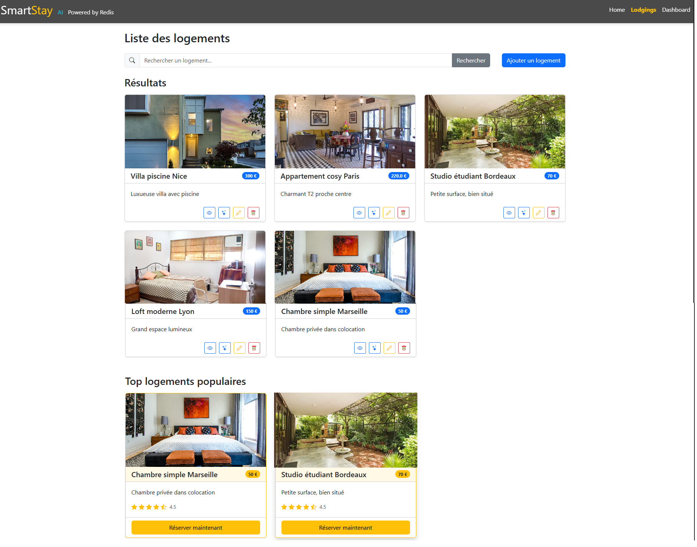
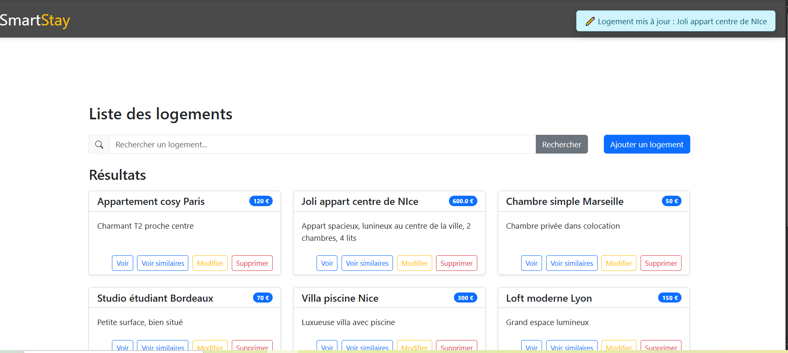
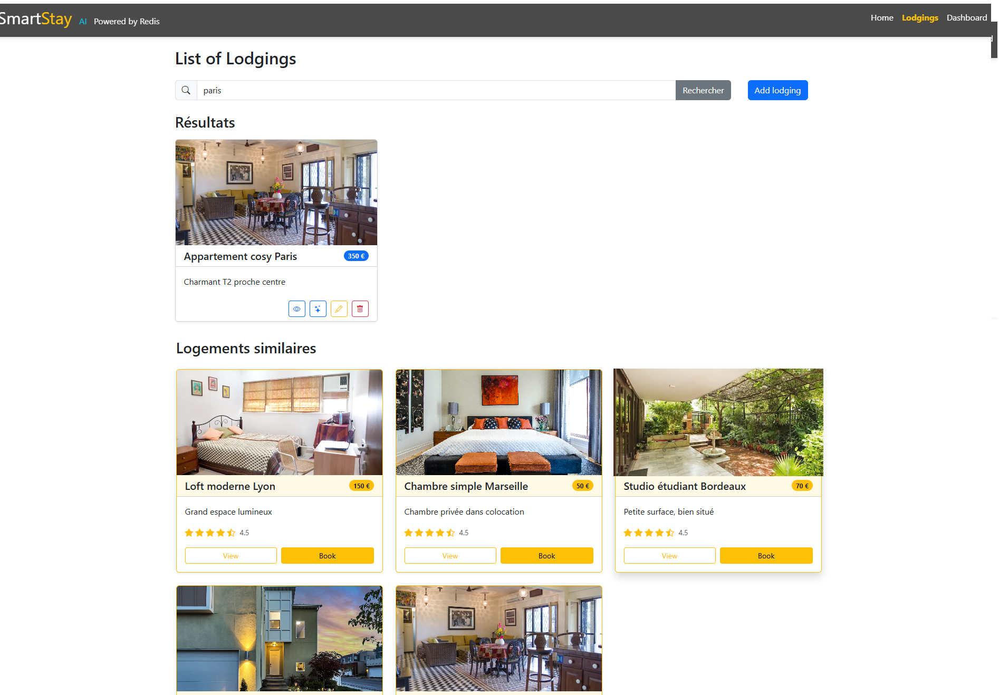
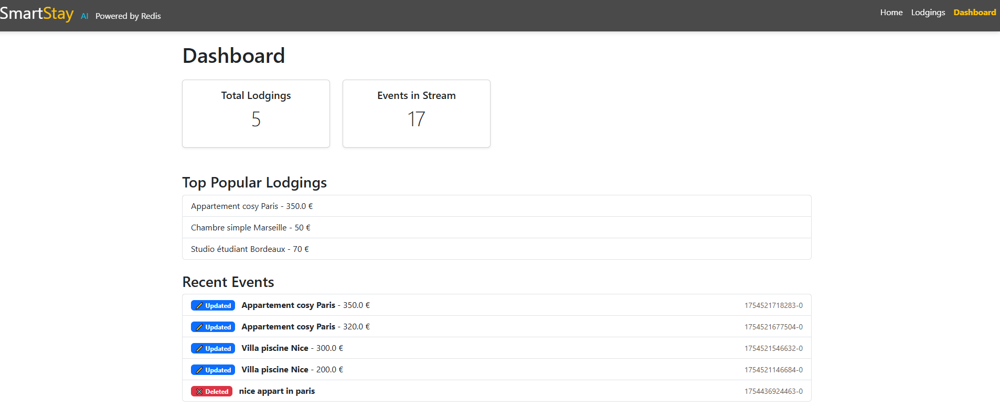

# SmartStay – Redis + AI Challenge 

Rails 7 application for managing lodgings with Redis Stack, real-time notifications via ActionCable, and AI integration (vector search with embeddings).

## 🎯 Challenge Goal

Store lodgings exclusively in Redis (no SQL database).

Real-time notifications for creation, update, and deletion.

Full-text search with RediSearch.

AI similarity search using Redis Vector Search + embeddings (currently mock).

## ✅ Implemented Features

- ✔ CRUD for lodgings (stored in Redis)
- ✔ Real-time broadcasts via ActionCable
- ✔ User notifications with Bootstrap Toasts
- ✔ Full-text search via RediSearch
- ✔ Popularity tracking with Redis ZSET
- ✔ Event history via Redis Streams
- ✔ Minimal dashboard: Top popular lodgings + recent events
- ✔ Persistence enabled (AOF with Docker)

## 🔥 Upcoming Features

- 🔍 AI vector search with real OpenAI embeddings
- 🧠 AI Assistant for recommendations
- 📊 Advanced dashboard for analytics
- ✅ Deployment on Render + Redis Cloud

## 🛠 Tech Stack

- Ruby: 3.1.3
- Rails: 7.2.2.1
- Redis Stack: Search, Vector, Streams
- ActionCable: Real-time notifications
- Bootstrap 5: Responsive UI
- Docker: Redis Stack container
- AI: OpenAI embeddings (mocked if no key)

## 🔧 Installation & Setup

1️⃣ Clone the repo

git clone https://github.com/YOUR_GITHUB_USERNAME/smartstay.git
cd smartstay
2️⃣ Install dependencies

bundle install
3️⃣ Run Redis Stack with persistence

docker run -d \
 --name redis-stack \
 -p 6380:6379 \
 -p 8001:8001 \
 -v ~/redis-data:/data \
 redis/redis-stack:latest
Redis Insight GUI: http://localhost:8001

Redis accessible: localhost:6380

4️⃣ Start Rails server

App URL: http://localhost:3000

✅ Quick Check (Rails console)

service = RedisLodgingService.new
service.save_lodging(id: SecureRandom.uuid, title: "Cozy studio", description: "Nice studio with balcony", price: 600)
service.list_all_lodgings
🔍 Search (RediSearch)

service.text_search("studio")
(Index is auto-created if missing)

🤖 AI Similar Search
Currently using mock embeddings if OPENAI_API_KEY is missing.
Button "Find Similar" triggers semantic search via Redis KNN.

📡 Real-time Notifications
Open 2 browser tabs, add a lodging → instant notification (via ActionCable)

UI (Bootstrap Toast container):

📊 Dashboard
Total Lodgings

Top Popular Lodgings (via ZSET)

Recent Events (via Redis Streams)

✅ Redis Persistence
Enable AOF:

docker exec -it redis-stack redis-cli CONFIG SET appendonly yes
docker exec -it redis-stack redis-cli CONFIG REWRITE
📸 Screenshots
See screenshots in the French section below.

✅ Next Steps
Switch from mock embeddings → real OpenAI API

Deployment on Render + Redis Cloud

Add analytics (stream aggregation)

## 🎥 Demo Video

Watch the full demo with subtitles:  
[▶ Watch on Kapwing](https://www.kapwing.com/videos/68938bf746b7eb3c758179cb)

## 📄 License

This project is licensed under the [MIT License](LICENSE).

## 🇫🇷 Version Française

Application Rails 7 pour la gestion des logements avec Redis Stack, notifications en temps réel via ActionCable, et intégration IA (recherche vectorielle avec embeddings).

🎯 Objectif du Challenge
Stocker les logements exclusivement dans Redis (sans base SQL)
Notifications en temps réel (création, mise à jour, suppression)
Recherche textuelle avec RediSearch
Recherche similaire via Redis Vector Search + embeddings IA (mock actuellement)

✅ Fonctionnalités Implémentées
✔ CRUD complet (logements stockés dans Redis)

✔ Diffusion temps réel avec ActionCable

✔ Notifications utilisateur (Bootstrap Toasts)

✔ Recherche textuelle rapide grâce à RediSearch

✔ Suivi de popularité avec Redis ZSET

✔ Historique des événements avec Redis Streams

✔ Mini-dashboard : Top logements + événements récents

✔ Persistance activée (AOF avec Docker)

🔥 Fonctionnalités à venir
🔍 Recherche vectorielle IA avec embeddings OpenAI réels

🧠 Assistant IA pour recommandations

📊 Tableau de bord avancé pour les statistiques

✅ Déploiement sur Render + Redis Cloud

🛠 Stack Technique
Ruby : 3.1.3

Rails : 7.2.2.1

Redis Stack : Search, Vector, Streams

ActionCable : Notifications temps réel

Bootstrap 5 : Interface responsive

Docker : Conteneur Redis Stack

IA : OpenAI embeddings (mock si clé absente)

🔧 Installation & Configuration
1️⃣ Cloner le projet

git clone https://github.com/VOTRE_UTILISATEUR/smartstay.git
cd smartstay
2️⃣ Installer les dépendances

bundle install
3️⃣ Lancer Redis Stack avec persistance

docker run -d \
 --name redis-stack \
 -p 6380:6379 \
 -p 8001:8001 \
 -v ~/redis-data:/data \
 redis/redis-stack:latest
Interface Redis Insight : http://localhost:8001
Redis accessible : localhost:6380

4️⃣ Démarrer le serveur Rails

bin/dev
Application : http://localhost:3000

✅ Vérification rapide (console Rails)

service = RedisLodgingService.new
service.save_lodging(id: SecureRandom.uuid, title: "Studio cosy", description: "Bel studio avec balcon", price: 600)
service.list_all_lodgings
🔍 Recherche (RediSearch)

service.text_search("studio")
(L’index est créé automatiquement au démarrage si absent)

🤖 Recherche similaire IA
Actuellement, embeddings mock si OPENAI_API_KEY non défini.
Bouton "Voir similaires" → recherche sémantique (KNN Redis).

📡 Notifications Temps Réel
Ouvrir 2 navigateurs, ajouter un logement → notification instantanée (via ActionCable)

UI (container Toast Bootstrap) :

📊 Dashboard  
Nombre total de logements

Top logements populaires (via ZSET)

Événements récents (via Redis Streams)

✅ Persistance Redis
Activer AOF :

docker exec -it redis-stack redis-cli CONFIG SET appendonly yes
docker exec -it redis-stack redis-cli CONFIG REWRITE

### 📸 Captures d’écran

---

📌 Page d’accueil (CRUD + notifications temps réel)
  

📌 Recherche textuelle & IA (Bouton Voir similaires)  

📌 Dashboard (Top logements + événements récents)  

🔥 Fonctionnalités à venir

🔍 Recherche vectorielle IA avec de vrais embeddings OpenAI

🧠 Assistant IA pour recommandations

📊 Tableau de bord avancé pour les statistiques

✅ Déploiement sur Render + Redis Cloud

## 🎥 Demo Video

Watch the full demo with subtitles:  
[▶ Watch on Kapwing](https://www.kapwing.com/videos/68938bf746b7eb3c758179cb)

## 📄 Licence

Ce projet est sous licence [MIT](LICENSE).
